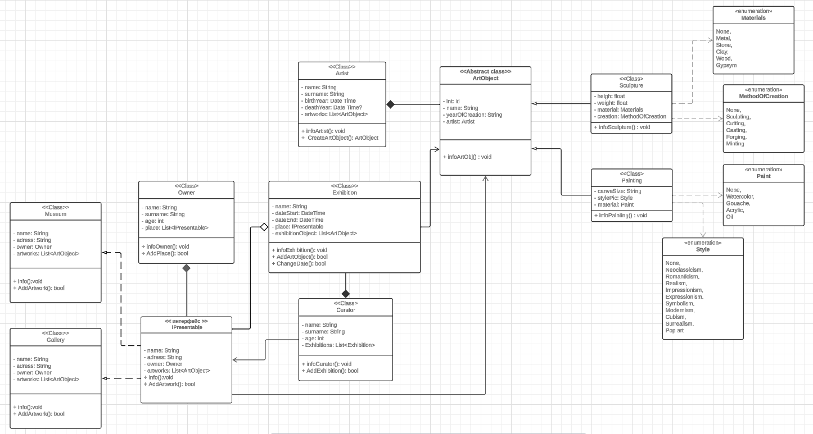

# Організація виставок арт-об’єктів

Проєкт розроблено для організації виставок арт-об’єктів.

Програма дозволяє кураторам організовувати виставки арт-об’єктів в музеях та галереях. Кожна виставка визначається назвою, датами проведення, місцем та списком арт-об’єктів, що на ній представлені. Куратори відповідають за керування виставками, а місця (музеї та галереї) визначаються інтерфейсом IPresentable.

Автори арт-об’єктів (Painting та Sculpture) представлені класом Artist, який містить інформацію про ім'я, прізвище, рік народження та рік смерті артиста. Кожен арт-об’єкт також характеризується своїми унікальними властивостями, такими як матеріал та метод створення для скульптур, розмір полотна та стиль живопису для картин.

Кожен власник (Owner) має можливість додавати та видаляти місця (музеї та галереї), а також виводити інформацію про себе. Програма створена з урахуванням необхідності взаємодії між усіма елементами, що робить її ідеальною для організації виставок арт-об’єктів у великому масштабі.

## Діаграма Класів

## Детальний опис класів

### **ArtObject (Абстрактний клас)**
- *id:* Унікальний ідентифікатор арт-об’єкта (int).
- *name:* Назва арт-об’єкта (String).
- *yearOfCreation:* Рік створення арт-об’єкта (String).
- *artist:* Автор арт-об’єкта (екземпляр класу Artist).
- *ArtObject(int id, string name, int? yearOfCreation, Artist artist):* Конструктор класу
- *infoArtObject():* Абстрактний метод для виведення інформації про арт-об’єкт.

### **Sculpture (Наслідується від ArtObject)**
- *height:* Висота скульптури (float).
- *weight:* Вага скульптури (float).
- *material:* Матеріал скульптури (Enum Materials).
- *creation:* Метод створення скульптури (Enum MethodOfCreation).
- *Sculpture(int id, string name, int? yearOfCreation, Artist artist, float height, float weight, Materials material, MethodOfCreation creation):* Конструктор класу
- *infoSculpture():* Метод для виведення інформації про скульптуру.

#### Enums
- **Materials:** None, Metal, Stone, Clay, Wood, Gypsum.
- **MethodOfCreation:** None, Sculpting, Cutting, Casting, Forging, Minting.

### **Painting (Наслідується від ArtObject)**
- *canvaSize:* Розмір полотна (String).
- *stylePic:* Стиль живопису (Enum Style).
- *material:* Матеріал картини (Enum Paint).
- *Painting(int id, string name, int? yearOfCreation, Artist artist, string canvaSize, Style stylePic, Paint material):*  Конструктор класу
- *infoPainting():* Метод для виведення інформації про картину.

#### Enums
- **Paint:** None, Watercolor, Gouache, Acrylic, Oil.
- **Style:** None, Neoclassicism, Romanticism, Realism, Impressionism, Expressionism, Symbolism, Modernism, Cubism, Surrealism, PopArt.

### **Artist**
- *name:* Ім'я артиста (String).
- *surname:* Прізвище артиста (String).
- *birthYear:* Рік народження артиста (DateTime).
- *deathYear:* Рік смерті артиста (DateTime).
- *ArtObjects:* Список арт-об’єктів, створених артистом (List<ArtObject>).
- *Artist(string name, string surname, int birthYear, int? deathYear = null):* Конструктор
- *infoArtist():* Метод для виведення інформації про артиста.
- *createArtObject(int id, string name, int? yearOfCreation, Artist artist, float height, float weight, Materials material, MethodOfCreation creation):* Метод для створення нового арт-об’єкта (скульптура).
- *createArtObject(int id, string name, int? yearOfCreation, Artist artist, string canvaSize, Style stylePic, Paint material):* Метод для створення нового арт-об’єкта (картина).

### **Exhibition**
- *name:* Назва виставки (String).
- *dateStart:* Дата початку виставки (DateTime).
- *dateEnd:* Дата закінчення виставки (DateTime).
- *place:* Місце проведення виставки (екземпляр, що реалізує IPresentable).
- *exhibitionObject:* Список арт-об’єктів на виставці (List<ArtObject>).
- *Exhibition(string name, DateTime startDate, DateTime endDate, IPresentable place, List<ArtObject>? exhibitionObjects):* Конструктор
- *infoExhibition():* Метод для виведення інформації про виставку.
- *AddArtObject(ArtObject newArtObject):* Метод для додавання арт-об’єкта до виставки.
- *ChangeDate(DateTime newStartDate, DateTime newEndDate):* Метод для зміни дати виставки.

### **Curator**
- *name:* Ім'я куратора (String).
- *surname:* Прізвище куратора (String).
- *age:* Вік куратора (int).
- *Exhibitions:* Список виставок, якими керує куратор (List<Exhibition>).
- *Curator(string name, string surname, int age):* Конструктор
- *infoCurator():* Метод для виведення інформації про куратора.
- *AddExhibition(string name, DateTime start, DateTime end, IPresentable place, List<ArtObject>? artworks):* Метод для додавання нової виставки.

### **IPresentable (Інтерфейс)**
- *name:* Назва місця (String).
- *address:* Адреса місця (String).
- *owner:* Власник місця (екземпляр класу Owner).
- *artworks:* Список арт-об’єктів у місці (List<ArtObject>).
- *info():* Метод для виведення інформації про місце.
- *AddArtwork9ArtObject artwork):* метод для додавання нових арт об'єктів до вже існуючого місця проведення

### **Owner**
- *name:* Ім'я власника (String).
- *surname:* Прізвище власника (String).
- *age:* Вік власника (int).
- *place:* Список місць, що належать власникові (List<IPresentable>).
- *Owner(string name, string surname, int age):* Конструктор
- *infoOwner():* Метод для виведення інформації про власника.
- *AddPlace(string name, string address, Owner owner, List<ArtObject>? artworks, bool isMuseum):* Метод для додавання нового місця власникові.

### **Museum (Наслідується від інтерфейсу IPresentable)**
- *info():* Override метод для виведення інформації про музей.
- *AddArtwork9ArtObject artwork):* метод для додавання нових арт об'єктів до вже існуючого місця проведення

### **Gallery (Наслідується від інтерфейсу IPresentable)**
- *info():* Override метод для виведення інформації про галерею.
- *AddArtwork9ArtObject artwork):* метод для додавання нових арт об'єктів до вже існуючого місця проведення

